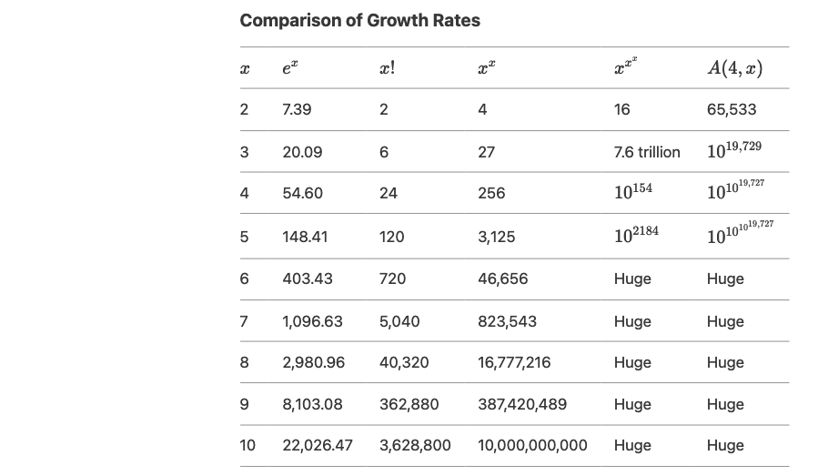

# How Fast Can Functions Grow? Exponential, Factorial, Tetration, and Ackermann

In mathematics, some functions grow slowly, like linear or quadratic functions, while others grow so quickly that their values become astronomically large even for small inputs. We will explore four functions that represent different levels of growth: **exponential**, **factorial**, **tetration**, and the **Ackermann** function. Each of these functions grows faster than the last, and understanding their growth rates helps us appreciate the vastness of mathematical possibilities.

---
## Exponential ($e^x$)
The exponential function $e^x$, where $e \approx 2.718$, is one of the fastest-growing functions in basic mathematics. It describes phenomena such as population growth, compound interest, and radioactive decay.

### Growth Rate
Exponential functions grow at a constant rate relative to their current value. For example, consider the exponential function, $f(x) = 2^x$. From the following table, we can see that the function always grows proportionally to its current value:

Exponential function grows very quickly: 

- $e^{10} \approx 22,026$
- $e^{20} \approx 485,165,195$

But it is just the beginning of the hierarchy of rapidly growing functions.

---

## Factorial ($x!$)
The factorial function $x! = 1 \times 2 \times 3 \times \dots \times x$ grows faster than exponential functions. Factorials are used in combinatorics, probability, and calculus.

### Growth Rate
Factorials grow faster than exponentials because they involve multiplying an increasing number of terms.

### Example
- $5! = 120$  
- $10! = 3,628,800$  
- $20! \approx 2.43 \times 10^{18}$

Despite its rapid growth, the factorial function is still outpaced by even faster-growing functions.

---

## Tetration (Iterated Exponentiation or exponential-tower)

### Definition

Tetration is the next hyperoperation after exponentiation. It is denoted as:

$$
^n x
$$

where $n$ is the height of the power tower.

For example:

$$
^2 x = x^x
$$

$$
^3 x = x^{x^x}
$$

$$
^4 x = x^{x^{x^x}}
$$

and so on.

### Growth Rate

Tetration grows much faster than exponentiation. For example, $^3 x = x^{x^x}$ grows significantly faster than regular exponentiation $x^x$.

### Specific Names Based on Height

- $^2 x = x^x$ → This is called **tetration of height 2** or simply **exponentiation**.
- $^3 x = x^{x^x}$ → This is called **tetration of height 3**.
- $^4 x = x^{x^{x^x}}$ → This is called **tetration of height 4**.

And so on.

### Why "Height"?

The term **height** refers to the number of levels in the **power tower** of exponents. For example: $^3 x = x^{x^x}$
has a height of 3 because there are three levels: $x$, $x^x$, and $x^{x^x}$.  
Each additional height level adds another exponentiation layer to the tower.

---

## Ackermann Function

The **Ackermann function** is a recursive function that grows extremely quickly. It is named after the German mathematician **Wilhelm Ackermann**, who introduced it in 1928. The function is defined for non-negative integers `m` and `n` as follows:

### Definition of the Ackermann Function

### How the Ackermann Function Works
The Ackermann function is recursive, meaning it calls itself repeatedly. Here’s how it works:

#### Base Case:
- If `m = 0`, the function returns `n + 1`.

#### Recursive Cases:
- If `m > 0` and `n = 0`, the function calls itself with `(m-1, 1)`.
- If `m > 0` and `n > 0`, the function calls itself twice: first with `(m, n-1)`, and then with `(m-1, result of first call)`.

### Why is the Ackermann Function Special?
- The Ackermann function **grows extremely quickly**, even faster than exponential functions like $e^x$ or tetration ($x^{x^x}$).
- It is a classic example of a **computable function that is not primitive recursive**, meaning it cannot be computed using simple loops or iterations.

### Values of the Ackermann Function
#### 1. $A(0, n) = n + 1$

| `n`  | `A(0, n)` |
|------|----------|
| 0    | 1        |
| 1    | 2        |
| 2    | 3        |
| 3    | 4        |
| 4    | 5        |
| 5    | 6        |

#### 2. $A(1, n) = n + 2$

| `n`  | `A(1, n)` |
|------|----------|
| 0    | 2        |
| 1    | 3        |
| 2    | 4        |
| 3    | 5        |
| 4    | 6        |
| 5    | 7        |

#### 3. $A(2, n) = 2n + 3$

| `n`  | `A(2, n)` |
|------|----------|
| 0    | 3        |
| 1    | 5        |
| 2    | 7        |
| 3    | 9        |
| 4    | 11       |
| 5    | 13       |

#### 4. $A(3, n) = 2^{(n+3)} - 3$

| `n`  | `A(3, n)` |
|------|----------|
| 0    | 5        |
| 1    | 13       |
| 2    | 29       |
| 3    | 61       |
| 4    | 125      |
| 5    | 253      |

#### 5. $A(4, n) = A(3,A(4,n−1))= 2^{A(4,n−1)+3} - 3$
This grows **extremely fast**:
- `A(4,1) = 65533`
- `A(4,2)` is a number with **19,729 digits**.
- `A(4,3)` is a number with more than **$10^{19727}$ digits**!

### Step-by-Step Computation of Ackermann Function $A(4,1)$

#### Step 1: Compute $A(4,1)$

Since $m = 4 > 0$ and $n = 1 > 0$, we use the third case of the definition:

$$
A(4,1) = A(3, A(4,0))
$$

#### Step 2: Compute $A(4,0)$

Since $m = 4 > 0$ and $n = 0$, we use the second case:

$$
A(4,0) = A(3,1)
$$

#### Step 3: Compute $A(3,1)$

Since $m = 3 > 0$ and $n = 1 > 0$, we use the third case:

$$
A(3,1) = A(2, A(3,0))
$$

#### Step 4: Compute $A(3,0)$

Since $m = 3 > 0$ and $n = 0$, we use the second case:

$$
A(3,0) = A(2,1)
$$

#### Step 5: Compute $A(2,1)$

Since $m = 2 > 0$ and $n = 1 > 0$, we use the third case:

$$
A(2,1) = A(1, A(2,0))
$$

#### Step 6: Compute $A(2,0)$

Since $m = 2 > 0$ and $n = 0$, we use the second case:

$$
A(2,0) = A(1,1)
$$

#### Step 7: Compute $A(1,1)$

Since $m = 1 > 0$ and $n = 1 > 0$, we use the third case:

$$
A(1,1) = A(0, A(1,0))
$$

#### Step 8: Compute $A(1,0)$

Since $m = 1 > 0$ and $n = 0$, we use the second case:

$$
A(1,0) = A(0,1)
$$

#### Step 9: Compute $A(0,1)$

Since $m = 0$, we use the first case:

$$
A(0,1) = 1 + 1 = 2
$$

#### Step 10: Back to $A(1,0)$

$$
A(1,0) = A(0,1) = 2
$$

#### Step 11: Back to $A(1,1)$

$$
A(1,1) = A(0,2)
$$

Since $A(0,n) = n + 1$, we compute:

$$
A(0,2) = 2 + 1 = 3
$$

#### Step 12: Back to $A(2,0)$

$$
A(2,0) = A(1,1) = 3
$$

#### Step 13: Back to $A(2,1)$

$$
A(2,1) = A(1,3)
$$

#### Step 14: Compute $A(1,3)$

Using the recurrence relation:

$$
A(1,3) = A(0, A(1,2))
$$

#### Step 15: Compute $A(1,2)$

$$
A(1,2) = A(0, A(1,1))
$$

From Step 11:

$$
A(1,1) = 3
$$

$$
A(1,2) = A(0,3) = 3 + 1 = 4
$$

#### Step 16: Back to $A(1,3)$

$$
A(1,3) = A(0,4) = 4 + 1 = 5
$$

#### Step 17: Back to $A(2,1)$

$$
A(2,1) = 5
$$

#### Step 18: Back to $A(3,0)$

$$
A(3,0) = 5
$$

#### Step 19: Back to $A(3,1)$

$$
A(3,1) = A(2,5)
$$

#### Step 20: Compute $A(2,5)$

Using the formula:

$$
A(2,n) = 2n + 3
$$

$$
A(2,5) = 2(5) + 3 = 13
$$

#### Step 21: Back to $A(3,1)$

$$
A(3,1) = 13
$$

#### Step 22: Back to $A(4,0)$

$$
A(4,0) = 13
$$

#### Step 23: Back to $A(4,1)$

$$
A(4,1) = A(3,13)
$$

#### Step 24: Compute $A(3,13)$

Using the formula:

$$
A(3,n) = 2^{(n+3)} - 3
$$

$$
A(3,13) = 2^{(13+3)} - 3 = 2^{16} - 3 = 65536 - 3 = 65533
$$

#### Final Answer for $A(4,1)$:

$$
A(4,1) = 65533
$$

### Summary of Ackermann Function, A(m,n) Values

Here’s a table of Ackermann function values for $m, n \leq 5$:

| \( m \) \ \( n \) | 1    | 2    | 3    | 4    | 5    |
|------------------|------|------|------|------|------|
| 0                | 2    | 3    | 4    | 5    | 6    |
| 1                | 3    | 4    | 5    | 6    | 7    |
| 2                | 5    | 7    | 9    | 11   | 13   |
| 3                | 13   | 29   | 61   | 125  | 253  |
| 4                | 65,533 | 19,729 digits | $10^{19,727}$ digits | $10^{10^{19,727}}$ digits | $10^{10^{10^{19,727}}}$ digits |

The Ackermann function is a fascinating example of a simple yet incredibly fast-growing function. It demonstrates the **limitations of primitive recursion** and highlights the **power of true recursion** in computation.

---

## Comparing the Growth Rates of the Functions: Exponential ($e^x$), Factorial ($x!$), Super-Exponential Growth ($x^x$), Tetration ($^3 x = x^{x^x}$), and Ackermann Function (A(4,x))

### Explanation of the Table  

#### Exponential Growth ($e^x$)  
Grows exponentially but remains manageable even for $x = 10$.  

#### Factorial Growth ($x!$)  
Grows faster than $e^x$ but is still computable for $x = 10$.  

#### Tetration of height 2, Super-Exponential Growth ($^2 x = x^x$)  
Grows super-exponentially but slower than $x^{x^x}$. It becomes large but remains computable for $x \leq 10$.

#### Tetration of height 3 ($^3 x = x^{x^x}$)  
Grows super-exponentially. For $x \geq 6$, the values become so large that they are impractical to compute or represent.  

#### Ackermann Function (A(4,x)) 
Grows hyper-exponentially. Even for $x = 3$, the value has 19,729 digits, and for $x \geq 4$, the values are beyond comprehension.  

### Key Observations  

- **Exponential Growth ($e^x$)**: Grows quickly but remains manageable for $x \leq 10$.  
- **Factorial Growth ($x!$)**: Grows faster than exponential but is still computable for $x \leq 10$.
- **Tetration of height 2, Super-Exponential Growth ($^2 x = x^x$)**: Grows faster than factorial but slower than $x^{x^x}$.
- **Tetration of height 3 ($^3 x = x^{x^x}$)**: Grows super-exponentially and becomes impractical for $x \geq 6$.  
- **Ackermann Function (A(4,x))**: Grows hyper-exponentially and becomes incomprehensible for $x \geq 3$.  

---

## Why Does Growth Rate Matter?

Understanding how fast functions grow is important in many fields:
Computer Science: Algorithms with exponential or factorial time complexity become impractical for large inputs.
- Physics: Some models of the universe involve hyper-exponential growth rates.
- Mathematics: Growth rates help us classify functions and understand their behavior.

## Conclusion

From exponential growth to the mind-boggling Ackermann function, the hierarchy of rapidly growing functions reveals the incredible diversity of mathematical behavior. While exponential functions like $e^x$ are already fast, factorial, tetration, and the Ackermann function push the boundaries of what we can compute and comprehend. These functions remind us that mathematics is not just about numbers—it’s about exploring the infinite possibilities of growth and complexity.

---
---

## Appendix: Hyperexponential?

### What Does Hyperexponential Mean?

Hyperexponential refers to functions that grow faster than exponential functions like $e^x$ or $a^x$.

This term describes functions exhibiting super-exponential growth, including:

- **Tetration** $x^{x^{...x}}$ (repeated exponentiation),
- **Iterated exponentiation** (repeated application of exponentiation),
- **The Ackermann function** (a rapidly growing recursive function),
- **Other functions** that surpass exponential growth.

### How is Hyperexponential Related to Tetration?

Tetration is a key example of a hyperexponential function, growing faster than exponentials due to iterated exponentiation.

For instance:

- $e^x$ grows exponentially,
- $x^x$ grows super-exponentially,
- $x^{x^{x^{x...}}}$ grows hyperexponentially.
